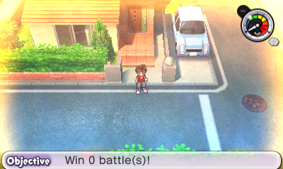

# Yo-kai

## No Yo-kai Appear

## Hurt Pandles

# Misc

## GGl (Gate of Whimsy Glitch)

Gate Glitch (or GGl) is a unique glitch currently only achievable via Save or RAM editing - although it has been theroised to be possible via *other methods*. It occurs when the *byte of wisom* is set to one of several values, including but not limited to `0xF0` - `0xFF`. This tricks the game into believing a Gate is occuring, despite it having no data on *which* Gate - leading to a sort of "null gate".

It causes the below oddities to occur (a frankenstein mix of Gates and normal gameplay):
* The pulsing rainbow/chromatic overlay normally used during Gates is stuck on-screen at all times.
* There are No NPCs (Including treasure chests), Shops (The buildings/bodies obviously still exist) or UI Interactions. The overworld is depopulated as if it were a Gate. 
* Random collision zones/forcefields appear in places that shouldn’t block you - perhaps areas where the minimap name changes even if it dosen't change the location (there are like 5 of these in Harrisville).
* The Diary, Battle, Medal Swap, Blasters apps are greyed out.
* Bikes and the icon on the bottom right of the minimap are disabled.
* Pause Menu shows "Give Up" option As if you’re mid-Gate or mid-battle. 
* The Current Objective becomes "Win 0 battle(s)!", probably as some sort of fallback/default Gate mission data. 
* Unlike normal Gates, music stays like the regular map BGM. 
* Normal loading zones don’t work (like walking to a different map via a street exit). Despite that, some interactions such as doors do.
* Changing areas plays the Gate entry animation (where you come out of the portal and a title card appears for a few seconds before you can move) but without a title card (e.g., "Expert Mission").
* If you enter a map that has Gate challenges:
   * A random Gate (from that area's Gate pool) will forcibly trigger.
      * You can leave and re-enter as much as you want, but the Gate never clears instead the gate progress resets when you leave.
   * No Gate Globes can be earned, as the exit goals never fulfill.
   * The Infinite Tunnel entrance becomes a bricked-up wall like when you’ve used all your daily attempts, but the tunnel’s black fog overlay still appears faintly (as if its graphics layer is still active).  

