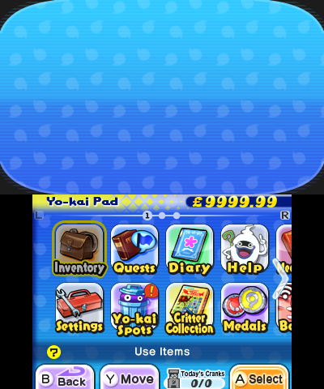
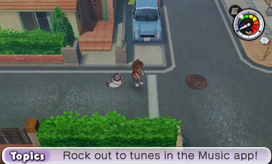

# Yo-kai

## No Yo-kai Appear
This is a very common issue. It stops the game from recognising your yokai, and leads to several issues. Note that this dosen't affect the selected "Comapnion Yo-kai" as this only stores what Yo-kai i.e. pandanoko - not which one this is in your medals and dosen't check if you *actually have* that Yo-kai.  

This is an example of what it may appear like in your inventory if your entire team is corrupted via this method. The good news is that since this is only the #0 and #1 entries, it *can* be restored with some effort - although tedious. 

## Hurt Pandles
This is a result of []. However, this is more serious as it *may* result in actual data loss. This form of corruption is catgeorised by level 0 yokai, with no HP or soul. These are usually either pandles or just yo-kai with a blank icon. Unlike the previous issue the game still considers them Yo-kai.
# Misc

## GGl (Gate of Whimsy Glitch)

Gate Glitch (or GGl) is a unique glitch currently only achievable via Save or RAM editing - although it has been theroised to be possible via *other methods*. It occurs when the *byte of wisdom* is set to one of several values, including but not limited to `0xF0` - `0xFF`. This tricks the game into believing a Gate is occuring, despite it having no data on *which* Gate - leading to a sort of "null gate".

It causes the below oddities to occur (a frankenstein mix of Gates and normal gameplay):
* The pulsing rainbow/chromatic overlay normally used during Gates is stuck on-screen at all times.
* There are No NPCs (Including treasure chests), Shops (The buildings/bodies obviously still exist) or UI Interactions. The overworld is depopulated as if it were a Gate. 
* Random collision zones/forcefields appear in places that shouldn’t block you - perhaps areas where the minimap name changes even if it dosen't change the location (there are like 5 of these in Harrisville).
* The Diary, Battle, Medal Swap, Blasters apps are greyed out.
* Bikes and the icon on the bottom right of the minimap are disabled.
* Pause Menu shows "Give Up" option As if you’re mid-Gate or mid-battle. 
* The Current Objective becomes "Win 0 battle(s)!", probably as some sort of fallback/default Gate mission data. 
* Unlike normal Gates, music stays like the regular map BGM. 
* Normal loading zones don’t work (like walking to a different map via a street exit). Despite that, some interactions such as doors do.
* Changing areas plays the Gate entry animation (where you come out of the portal and a title card appears for a few seconds before you can move) but without a title card (e.g., "Expert Mission").
* If you enter a map that has Gate challenges:
   * A random Gate (from that area's Gate pool) will forcibly trigger.
      * You can leave and re-enter as much as you want, but the Gate never clears instead the gate progress resets when you leave.
   * No Gate Globes can be earned, as the exit goals never fulfill.
   * The Infinite Tunnel entrance becomes a bricked-up wall like when you’ve used all your daily attempts, but the tunnel’s black fog overlay still appears faintly (as if its graphics layer is still active).  

## Ghost Wallpaper
This glitch creates several neat oddities, including: breaking the captions, hiding decimal points, and leaving you with a plain black Yo-kai Pad Wallpaper. It takes position -1 in the wallpaper select (before Cool Blue - the first wallpaper), and occurs when your wallpaper is set to an invalid value (`0x10`-`0xFF`). It is the *only* wallpaper to be nameless (showing as blank in the wallpaper select) and aside from that the above it causes no harmful problems. Just a neat oddity

## Ghost Bicycle and Ghost Bell
These are both caused by invalid values. Bad bicycle skin leads to the bicycle being invisible, bad bell makes it silent. 

